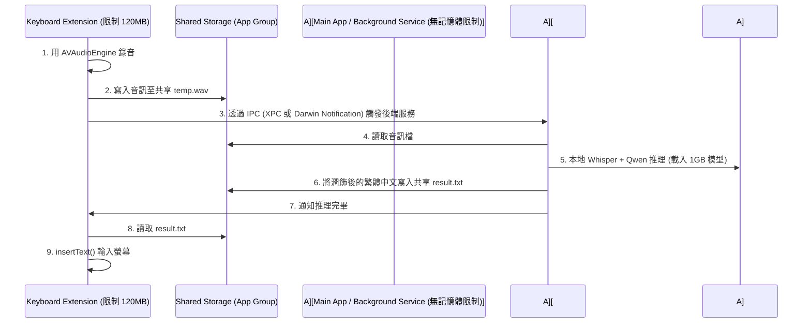

# EchoWrite 進階優化與架構升級建議 (optimization_proposals.md)

為了將 **EchoWrite** 打造為極致流暢、省電且商用級穩定的語音助理，我們在「模型效能、錄音體驗、行動端記憶體優化」等維度，為您整理了以下進階優化建議與實作指南：

---

## 1. 核心模型優化：硬體加速與量化選擇

本地端運算的瓶頸在於 CPU 消耗與電池壽命，我們可以透過以下手段發揮晶片最大效能：

### A. 啟用 Apple 晶片神經引擎與 GPU 加速
*   **Whisper CoreML 加速**：
    -   `whisper.cpp` 支援將模型編譯為 Apple CoreML 格式，利用 iPhone 與 Mac 的 **Apple Neural Engine (ANE)** 進行硬體加速。
    -   *實作方式*：在編譯 `whisper-rs` 時啟用 `coreml` feature。這能將 ASR 的轉寫速度提升 3~5 倍，並減少 90% 的 CPU 耗能，徹底避免發熱。
*   **Llama Metal GPU 加速**：
    -   在 macOS 上，確保 llama.cpp 連結了 Apple Metal 框架，使 LLM 的推理完全運行在 GPU 上，令 Token 生成速度突破 50+ tokens/sec。

### B. 最佳模型尺寸與量化配比
*   **ASR 推薦**：`whisper-base-q5_1.bin`（約 140MB）。對繁體中文及中英夾雜的辨識度極高，且載入速度極快。
*   **LLM 推薦**：`Qwen-2.5-1.5B-Instruct-Q4_K_M.gguf`（約 1.1GB）或更小型的 `Qwen-2.5-0.5B-Instruct-Q5_K_M.gguf`（約 390MB）。對於單純的口語潤飾、句式整理與標點修正，0.5B ~ 1.5B 尺寸的模型在 GPU 上可達到即時出字的效果。

---

## 2. 轉寫精準度優化：引導 Prompt 注入

本地端 ASR 最大的痛點是容易將專有名詞（如公司名、縮寫、人名）辨識錯。
*   **Whisper 初始引導詞 (Initial Prompt) 注入**：
    -   `whisper-rs` 的轉寫參數支援設定 `initial_prompt`。
    -   *優化作法*：從 SQLite 資料庫中讀取使用者的「常用通訊錄」與「自訂詞彙表」（如：`EchoWrite, Slack, Cursor, Barret`），並拼接成引導詞傳入 Whisper。這將強制導引 ASR 將發音相近的聲音精確轉寫為指定的專有名詞，WER (字錯率) 會顯著降低。

---

## 3. 行動端記憶體避障：iOS 120MB 記憶體上限解決方案

> [!WARNING]
> **iOS App Store 的嚴格限制**：
> iOS 系統規定「第三方輸入法 Extension」的記憶體佔用**絕對不能超過 120MB**。一旦超過，系統會毫無預警地直接閃退（Crash）鍵盤。我們的 LLM 模型（即便量化後也是 390MB~1GB）絕對無法直接在 Keyboard Extension 程序內載入！

### 🚀 解決方案：IPC 背景常駐進程架構 (XPC / Service Helper)
為了在上架 iOS App Store 時不崩潰，必須採用「鍵盤外殼錄音，App 本體推理」的異步架構：

*   **iOS 實作**：主 App 註冊為 XPC 服務或透過 Darwin Notification Center 與 App Groups 進行檔案級 IPC 通訊。
*   **Android 實作**：將 `EchoWriteIME` 定義為能與 Background Service 連線的 Bound Service，確保模型只在 Service 中加載，維持 IME 鍵盤本體的流暢度與低記憶體水位。

---

## 4. 極致 UX 互動優化：「樂觀排版」與「即時取消」

*   **樂觀排版 (Optimistic Streaming typing)**：
    -   當 ASR 辨識出 raw text 時，我們不用等待 LLM 處理，可以「先將 raw text 以灰色斜體或底線樣式」打入輸入框。
    -   一旦 LLM 生成完畢，再自動取代掉剛剛的草稿。這會讓使用者覺得輸入反應是「即時」的。
*   **滑動取消 (Swipe to Cancel)**：
    -   在手機上錄音時，若中途想取消，支援往左滑動按鈕即可放棄此次錄音（直接清空 Buffer，不觸發 AI 推理），提供流暢的防呆互動。
*   **語音命令即時阻斷 (Hotword Interrupt)**：
    -   當使用者在說話中提到「取消錄音」、「算了不用」時，ASR 背景模組立刻中斷語音傳輸，不將垃圾文本寫入。
