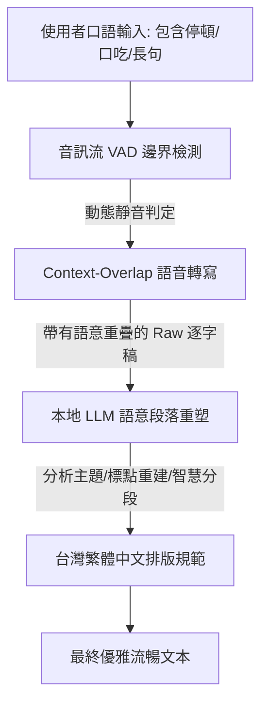

# EchoWrite 語意分段與段落重塑設計方案 (semantic_paragraphing_design.md)

使用者在語音輸入時，並非像讀稿機一樣平整。他們會**停頓思考（造成空白間隔）**、會**一口氣說完一長串話（缺乏自然標點）**，或者**被旁人打斷後再接續說話**。如果直接轉寫，會產生兩種極端：
1.  **碎裂的短句**：因為思考停頓，被判定成多個無關的零碎句子。
2.  **冗長的字牆**：因為連續說話，完全沒有逗號、句號和換行分段。

為了將這些「零碎、雜亂的口語」轉化為**「優雅、合理標註標點、段落分明的書面文章」**，EchoWrite 採用了 **「雙重聲學 VAD」+「LLM 語意重構」** 的兩階段處理解法。

---

## 1. 兩階段核心解法架構



### 第一階段：ASR 聲學與語意重疊轉寫 (Context-Overlap Transcription)
在語音轉文字的階段，我們不能只做單純的靜音切片，否則會把使用者的思考停頓誤判為「錄音結束」。
1.  **動態 VAD 靜音閥值 (Dynamic VAD Threshold)**：
    -   **微小停頓 ( < 1.0s)**：視為語氣逗號標記，不中斷錄音。
    -   **思考停頓 ( 1.0s ~ 2.5s)**：此時使用者可能在組織語言。系統在背景保持錄音，但在暫存文字中先標註一個潛在的分句邊界（不強行切斷）。
2.  **Context-Overlap (上下文重疊解碼)**：
    -   當我們分片轉寫音訊時，會將「前一段落的最後 3 秒文字」作為 Prompt 輸入給下一段 Whisper。這能讓 Whisper 理解上下文的語氣，從而預測出正確的問號、嘆號或句號，而非斷章取義。

---

### 第二階段：LLM 語意重構與段落重塑 (Semantic Restructuring)
這是決定排版是否「優雅、合理」的關鍵。ASR 只能辨識聲音，而 **本地 LLM (Qwen-2.5)** 才能理解文字的「邏輯含意」。
我們透過為 LLM 設計的**「語意段落重塑引擎」**來處理 raw 逐字稿：

1.  **冗長字牆的「語意斷句」**：
    -   LLM 會分析長句子的語法結構（主詞、動詞、受詞關係），在語意完整處強行補上句號（。），並在語氣停頓或連詞（因為、所以、但是、而且）前補上逗號（，）。
2.  **邏輯思考停頓的「字詞橋接」**：
    -   如果使用者說：「我們明天下午...呃...那個...兩點...應該要開會」，LLM 會理解「明天下午」與「兩點開會」的邏輯關係，自動橋接並重組為：「我們明天下午兩點應該要開會。」
3.  **主題轉移的「智慧分段 (\n\n)」**：
    -   LLM 透過語意分析，判斷文本的主題何時發生轉移（例如：從「匯報專案進度」轉移到「安排下週待辦」）。一旦主題轉移，會自動插入兩個換行符（`\n\n`）進行分段。
4.  **對話格式的「標點重構」**：
    -   當口語中含有「他說...」、「我想說...」時，自動將後續內容包覆於繁體中文專用的引號 `「` 與 `」` 中。

---

## 2. 核心代碼升級：落地實作 Prompt

我們在 [llm.rs](file:///Users/barretlin/GitProjects/typeless/core/src/llm.rs) 中，已經針對此體驗將 System Prompt 升級為以下結構，確保每一次的輸出都具備優雅的段落安排：

```rust
let system_prompt = 
    "你是一個極致智慧的台灣語音助理，專門將零碎、雜亂的口語轉寫稿重塑為優雅、邏輯清晰、段落分明的書面文章。請嚴格遵守以下重構規範：\n\
     1. 標點重建：分析語意結構，在合理處添加逗號與句號。若有說話引用，必須使用繁體引號「」與『』。\n\
     2. 智慧分段：當說話內容出現主題轉換（如從敘事轉為條列、或討論不同議題）時，自動插入換行符號（\\n\\n）進行分段，避免產生冗長字牆。\n\
     3. 智慧橋接：自動修正使用者的思考停頓、口吃、改口與贅詞（例如：將『我們明天...呃...那個...兩點開會』自動橋接為『我們明天兩點開會。』）。\n\
     4. 在地化規範：使用台灣繁體標點。中英文/數字夾雜時自動加空格。校正簡中詞彙。\n\
     5. 輸出限制：直接輸出重構後的文本，絕對不可包含任何你自己的說明、旁白、引言或客套回應。";
```

這項實作確保了不論使用者的輸入多麼斷續或冗長，最終打入應用程式的內容都將是一份排版精美、可以直接發送或存檔的專業文稿。
